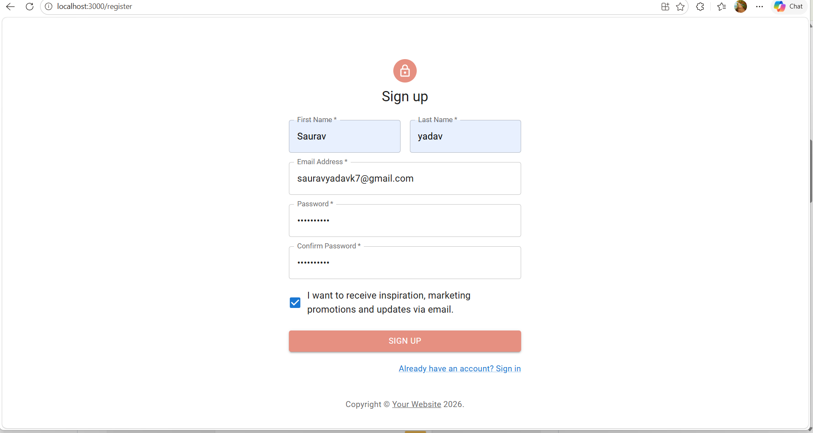
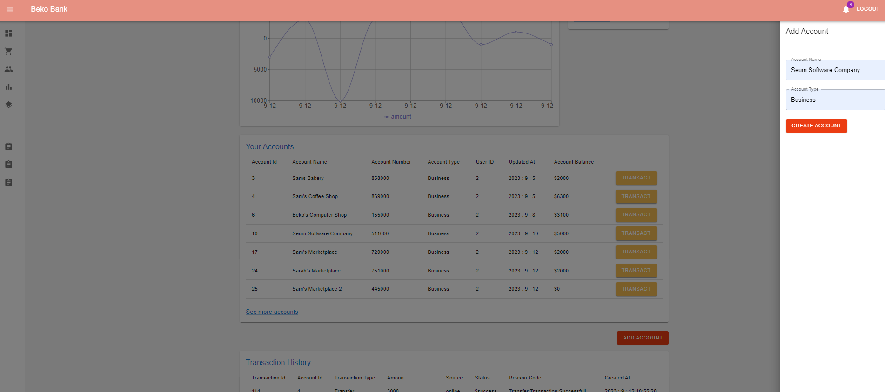

# Full Stack Banking Application

A full stack online banking application built with Java Spring Boot, React Redux, JWT Authentication and MySQL. Features secure user authentication, email verification, account management, and real-time transaction history.

## 🎯 Project Overview

This project demonstrates a complete full stack banking system with secure JWT-based authentication, email verification, account management, and transaction processing. Built with Spring Boot REST API backend and React Redux frontend.

## 📸 Screenshots








## 🚀 Features

- Secure JWT authentication and authorization
- User registration with Email Verification (Gmail SMTP)
- Account creation and management
- Deposit, Withdraw, Transfer funds
- Payment to Beneficiaries
- Transaction history tracking
- Real-time balance updates
- Responsive React dashboard

## 🛠️ Tech Stack

| Layer | Technology |
|---|---|
| Backend | Java, Spring Boot |
| Frontend | React, Redux, Material UI |
| Database | MySQL 8.0 |
| Authentication | JWT |
| Security | BCrypt Password Hashing, Spring Security |
| Email | Gmail SMTP |
| API | REST APIs |
| Tools | Git, GitHub, Maven |

## ⚙️ How to Run

### Prerequisites
- Java JDK 17+
- Maven 3.6+
- Node.js 16+
- MySQL 8.0+

**1. Clone the repository**
```bash
git clone https://github.com/Saurav0094/Full-Stack-Banking-App.git
cd Full-Stack-Banking-App
```

**2. Configure Database**
```sql
CREATE DATABASE IF NOT EXISTS demobankdb;
```

**3. Configure application.properties**

Open `Online Banking App Spring Boot/src/main/resources/application.properties` and update:
```properties
spring.datasource.username=your_mysql_username
spring.datasource.password=your_mysql_password
```

**4. Set Email Environment Variables**

Windows:
```cmd
setx MAIL_USERNAME "your_gmail@gmail.com" /M
setx MAIL_PASSWORD "your_16_digit_app_password" /M
```

Linux/Mac:
```bash
export MAIL_USERNAME="your_gmail@gmail.com"
export MAIL_PASSWORD="your_16_digit_app_password"
```

> To generate Gmail App Password: Google Account → Security → 2-Step Verification → App Passwords

**5. Run Backend**
```bash
cd "Online Banking App Spring Boot"
mvn spring-boot:run
```
Backend runs on `http://localhost:8070`

**6. Run Frontend**
```bash
cd demo-bank-redux
npm install
npm start
```
Frontend runs on `http://localhost:3000`

## 🧠 How It Works

1. User registers and receives email verification link
2. After verification, user logs in via React frontend
3. Spring Boot backend validates credentials and issues JWT token
4. JWT token is stored and sent with every API request
5. Backend processes transactions and updates MySQL database
6. React Redux manages frontend state in real-time

## 📌 Future Improvements

- Complete placeholder pages (Orders, Customers, Reports)
- Add pagination for transaction history
- Write unit tests (JUnit + Jest)
- Dockerize the application
- Deploy on AWS

## 👨‍💻 Author

**Saurav**
B.Tech CSE | Kanpur Institute of Technology
[GitHub](https://github.com/Saurav0094) | [LinkedIn](https://www.linkedin.com/in/saurav-yadav-124293228/)